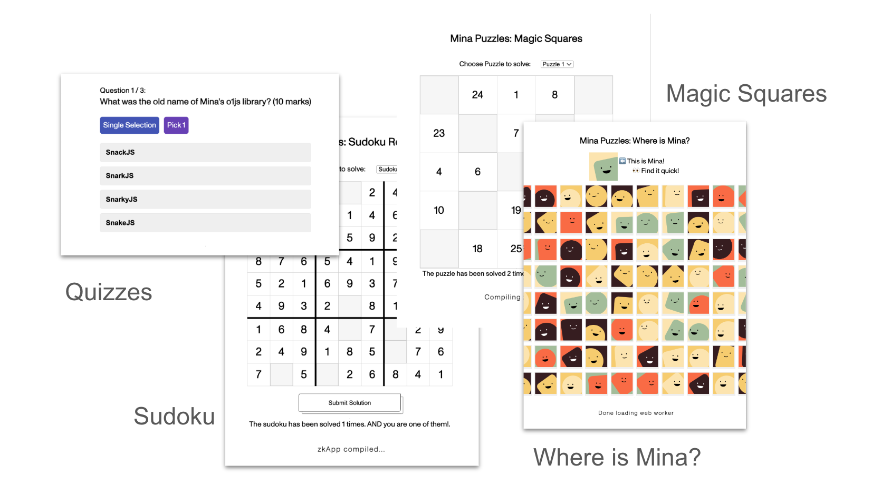

# 🧩 mina-puzzles
series of simple puzzle games built using o1js on Mina

https://mina-puzzles.vercel.app



[](https://www.youtube.com/watch?v=ynLKD_abuBQ "Demo Video")

Demo video: https://www.youtube.com/watch?v=ynLKD_abuBQ

## 🎯 Objectives
- Learn and share my learning as part of my Mina Navigator journey
- Start with simple but fun and meaningful
- Extend and incorporate other advanced features of Mina
- Focus on UI/UX and end-users
 
## 🌟 Highlights
- UI uses background worker so that puzzle is playable right away
- Each contract can host multiple players and multiple puzzles
- Use of emitEvent to record puzzle completions
- Video docs to walkthrough code as well as demos

## 🎮 Play now
-  **Magic Squares:** [website](https://mina-puzzles-magic-squares.vercel.app/)
-  **Sudoku Redux:** [website](https://mina-puzzles-sudoku-redux.vercel.app/)
-  **Where is Mina?:** [website](https://mina-puzzles-where.vercel.app/)
-  **Quiz:** [website](https://mina-puzzles-quiz.vercel.app/)
-  **Tictactoe Redux:** [demo](https://www.youtube.com/watch?v=wbA30WsLbOI)
-  **RockPaperScissors Async:** [demo](https://www.youtube.com/watch?v=xUO4q5diL08)

## 🧠 Ideas for puzzles/games
Please suggest, if you have one :)
- [x] where is waldo? where is mina?
- [x] quiz / trivia
- [x] sudoku redux
- [x] magic squares
- [x] paper-scissor-stone 
	- P2P, private commits and reveal at the same time
- [x] P2P tic-tac-toe
	- Recursive proof, P2P via webRTC/websocket

## 🧪 Concepts to be explored and implemented

- composability (i.e: shared leaderboard across puzzles)
- inclusion proof (i.e: 1 of many possible answers)
- P2P game play using recursion and websocket/webRTC
- smooth loading of UI/UX for game play
- extensive use of Merkle Tree and local storage

## 🏗️ Code structure

Each puzzle is in its own folder, further containing `ui` and `contracts` folders

For instance:
```
magic-squares/ui
magic-square/contracts
```

Getting started with `contracts` folder
```
# get into folder
cd magic-squares/contracts

# install
npm install

# build - buid scripts can be found in ./build/src/
npm run build

# run test - refer to MagicSqures.test.ts
npm run test

# generate public private keypair for contract
zk config

# deploy the contract with above keypair
zk deploy <alias>

# update script - to update state for puzzles in contract
node ./build/src/update.js
```

Getting started with `ui` folder
```
# get into folder
cd magic-squares/ui

# install
npm install

# set config
# copy example config file and set NEXT_PUBLIC_ZKAPP_ADDRESS
# NEXT_PUBLIC_ZKAPP_ADDRESS is the public key of alias used for contract deployment
cp local.env.example local.env

# start running dev version of NextJS
npm run dev

# NextJS site would be running in localhost:3000
# refer to src/pages/index.page.ts
```

## 🗒️ Dev notes

#### On multiple games and player per contract
Instead of each user deploying a contract per game, only 1 contract is deployed. Each games can host unlimited players as users' puzzle completions are emitted as events `emitEvent` feature of Mina.

```
this.emitEvent('solved', {
	solver:  this.sender,
	puzzleHash:  puzzleHash,
});
```
use of action/reducer or merkle tree would be explored.

8 games/puzzles can be hosted per contract, utilizing 8 states available in the contract.
```
@state(Field) puzzleHash1 = State<Field>();
@state(Field) puzzleHash2 = State<Field>();
@state(Field) puzzleHash3 = State<Field>();
@state(Field) puzzleHash4 = State<Field>();
```

Merkle tree could be used for unlimited games?

#### On UI/UX and smooth game play

Background web worker is utilized and game is made playable right from the start. Submission button will be shown when contract has been compiled.

Tutorial 4 is referenced https://docs.minaprotocol.com/zkapps/tutorials/zkapp-ui-with-react

Other concepts such as pre-compilation or cloud compilation would be explored in the following months

### On P2P realtime game play

Websocket (via Ably) is used for sending game updates (recursive proof and chat messages) realtime between 2 players.
Key Value storage (via Vercel) is used to store active game channels, to cache proofs

Mina's recursive proofs are awesome to create P2P games, to reduce UX frictions as minimal wallet and blockchain interactions are needed, but still with Mina's full ZK offerings

#### On structure and scaffold

As I build more and more puzzles/games, I start to notice how structure and off-the-shelf components could be useful to smoothen developer journey and boost productivity.

It is on my mind to make this into a  🕹️ **Mina game starter kit**

## 📹 Video documentation

Video says a million words. Lots of videos would be used to document my learning journey so that others can easily referenced to it.

- Detailed code walkthrough step-by-step with video
	- From `git clone` to deploying contract on Mina, and launching the UI site on Vercel
    - https://wind-radish-f93.notion.site/Mina-Puzzle-detailed-code-walkthrough-with-video-b7d03a0c7d1c4251b0b56371cd82aa5a
- Demo videos of games
- https://www.youtube.com/watch?v=ynLKD_abuBQ 
- https://www.youtube.com/watch?v=wbA30WsLbOI (Tictactoe Redux)
- https://www.youtube.com/watch?v=xUO4q5diL08 (RockPaperScissors Async)
